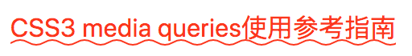

# 下划线 hover 时变波浪线



```css
.a_link,
.entry a[href*="m/study/"] {
  color: #f30;
  text-decoration: underline;
  padding: 2px 0;
}

/* <svg xmlns='http://www.w3.org/2000/svg' viewBox='0 0 20 4'><path fill='none' stroke='#ff3300' d='M0 3.5c5 0 5-3 10-3s5 3 10 3 5-3 10-3 5 3 10 3'/></svg> */
.a_link:hover,
.entry a[href*="m/study/"]:hover {
  color: #f30;
  text-decoration: none;
  background: url(
      data:image/svg + xml,
      %3Csvgxmlns="http://www.w3.org/2000/svg"viewBox="0 0 20 4"%3E%3Cpathfill="none"stroke="%23ff3300"d="M0 3.5c5 0 5-3 10-3s5 3 10 3 5-3 10-3 5 3 10 3"/%3E%3C/svg%3E
    ) repeat-x 0 100%; /* url() 内容需要修复，格式化代码变动 */
  background-size: 20px auto;
  animation: waveMove 1s infinite linear;
}

@keyframes waveMove {
  0% {
    background-position: 0 100%;
  }
  100% {
    background-position: -20px 100%;
  }
}

/* {
animation-duration: 1s;
animation-timing-function: linear;
animation-delay: 0s;
animation-iteration-count: infinite;
animation-direction: normal;
animation-fill-mode: none;
animation-play-state: running;
animation-name: waveMove;
} */
```
