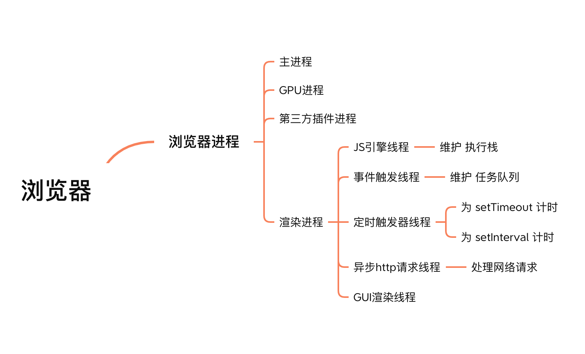
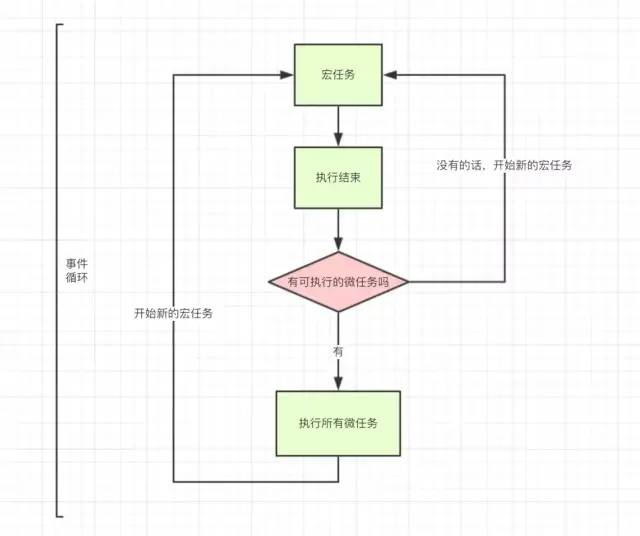
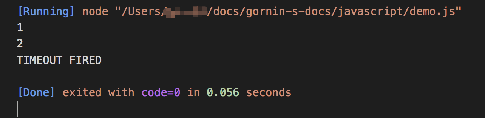

# JavaScript 运行机制

## 学习前所知

js 是单线程的，不能并发执行

主线程处理同步事件，异步时间进入 event table，注册回调函数

js 引擎会不断的检测同步任务栈还有没有任务，如果没有任务，会从事件队列中取任务放到主线程中执行

Event Loop 事件循环

同步任务与异步任务

宏任务与微任务

setTimeout 与 setInterval

Promise 与 process.nextTick()

## 学习资料

阮一峰老师的日志 [JavaScript 运行机制详解：再谈 Event Loop](https://www.ruanyifeng.com/blog/2014/10/event-loop.html)

pudn [JS 运行机制](https://www.pudn.com/news/630dda0288df2007aaf55343.html)

## 笔记

js 是单线程的，也就是说不能同时干多个事情，同一个时间只能做一件事。

单线程容易造成页面卡顿，影响用户体验。

### JavaScript 单线程 和 浏览器多线程

JavaScript 单线程指的是浏览器中负责解释和执行 JavaScript 代码的只有一个线程，即为 JS 引擎线程，但是浏览器的渲染进程是提供多个线程的



### 为什么 js 是单线程的，不能有多线程呢？

主要跟其用途有关，处理页面中用户交互，操作 dom 树、CSS 样式树，不需要多线程，避免出现复杂的同步问题。

> 思考：引入多线程，也就带来了复杂的同步问题，可以用锁加以限制，但是会带来更大的复杂性。

引申：H5 Web Worker 的提出，为了利用多核 CPU 的计算能力，使浏览器的 js 引擎可以并发的执行 js 代码，实现了对浏览器端多线程编程的良好支持。
即便可以创建多个子线程，但是子线程不能操作 dom，受控于主线程。

由于 JavaScript 是可操纵 DOM 的，如果在修改这些元素属性同时渲染界面（即 JavaScript 线程和 UI 线程同时运行），那么渲染线程前后获得的元素数据就可能不一致。

为了防止渲染出现不可预期的结果，<span style="color:#42b983">浏览器设置 <b>UI 渲染线程</b> 与 <b>JavaScript 引擎线程</b> 为互斥的关系</span>，当 JavaScript 引擎线程执行时 UI 渲染线程会被挂起，UI 更新会被保存在一个队列中等到 JavaScript 引擎线程空闲时再执行。

### 同步任务 & 异步任务

同步任务（synchronous）指的是，在<span style="color:#42b983">主线程</span>上排队执行的任务，只有前一个任务执行完毕，才能执行后一个任务；

异步任务（asynchronous）指的是，不进入主线程、而进入<span style="color:#42b983">"任务队列"（task queue）</span>的任务，只有"任务队列"通知主线程，某个异步任务可以执行了，该任务才会进入主线程执行。

### 实现异步的方法

- 延迟类：setTimeout、setInterval、requestAnimationFrame、setImmediate
- 监听事件实现：监听 new Image 加载状态、监听 script 加载状态、监听 iframe 加载状态、message
- 类型：Promise、ajax

### 如何做到 JS 异步非阻塞

当遇到计时器、DOM 事件监听或者是网络请求的任务时，JS 引擎会将它们直接交给 webapis 去处理，也就是浏览器提供的相应线程(如定时触发器线程处理 setTimeout 计时、异步 http 请求线程处理网络请求)，而 JS 引擎线程继续后面的其他任务，这样便实现了异步非阻塞。

如定时器触发线程，只是为 setTimeout(callback, 1000) 定时而已，时间一到就会把对应的回调函数(callback)交给<b>任务队列</b>去维护，JS 引擎线程会去任务队列取出任务并执行。

### 执行栈与任务队列

> 栈 是一种 LIFO（Last In, First Out）的数据结构，特点即 后进先出。

<span style="color:#42b983">JS 引擎会维护一个执行栈</span>，同步代码会依次加入执行栈后执行，结束后退出执行栈；
如果执行栈里的任务执行完毕，即执行栈为空的时候，js 引擎线程空闲，事件触发线程才会从消息队列取出一个任务放入执行栈执行。

```js
const bar = () => console.log("bar");
const baz = () => console.log("baz");
const foo = () => {
  console.log("foo");
  bar();
  baz();
};
foo();
```


> 队列 是一种 FIFO(First In, First Out) 的数据结构，它的特点就是 先进先出。

<span style="color:#42b983">事件触发线程，由浏览器渲染引擎提供，会维护一个任务队列。</span>JS 引擎线程遇到异步(DOM 事件监听、网络请求、setTimeout 计时器等...)，会交给相应的线程单独去维护异步任务，等待时机(计时器结束、网络请求成功、用户点击 DOM)，然后由<u><span style="color:#42b983">事件触发线程</span>将异步对应的 回调函数 加入到任务队列中</u>，任务队列中的回调函数等待被执行。

### 任务队列的维护

js 主线程有一个事件队列，这个事件队列由事件触发线程维护，其他的线程(如定时器触发线程或 http 线程）也有自己的任务队列，当这些线程的事件执行完成的时候，相应的回调函数首先被放入自己事件队列中去，然后由事件触发线程将其放入到 js 主线程的事件队列里，js 主线程会在栈被清空时去执行自己的事件队列。这就是事件触发线程对 js 主线程任务队列的维护。

#### Event Table

一个异步事件与对应的回调函数的对应表

#### 任务队列 Event Queue

回调函数的队列，亦称为 Callback Queue，当 Event Table 中的事件被触发，事件对应的 回调函数 就会被 push 进这个 Event Queue，然后等待被执行。

### 运行机制如下

1. 所有同步任务都在主线程上执行，形成一个执行栈 execution context stack
2. 主线程之外，存在一个任务队列 task queue，只要异步任务有了运行结果，就在 任务队列 之中放置一个事件
3. 一旦执行栈中的所有同步任务执行完毕，系统就会读取任务队列，获取待处理事件对应的异步任务，结束等待状态，进入主线程执行栈执行
4. 主线程重复上面的第三步


### 任务队列的类型

> 宏任务 与 微任务

宏队列 macrotask queue 【tasks】

> 唯一，整个事件循环当中，仅存在一个，执行为同步。

- setTimeout
- setInterval
- I/O
- requestAnimationFrame (浏览器独有)
- UI rendering (浏览器独有)
- setImmediate (Node 独有)

微队列 microtask queue 【jobs】

> 不唯一，存在一定的优先级（用户 I/O 部分优先级更高）；异步执行，同一事件循环中，只执行一个。

- Promise
- Object.observe
- MutationObserver
- process.nextTick (Node 独有)

### 事件循环 event loop

1. 全局代码执行完毕后，调用栈 Stack 会清空。
2. 然后从微队列 microtask queue 中取出位于队首的回调任务，放入调用栈 Stack 中执行，执行完后 microtask queue 长度减 1，
3. 继续取出位于队首的任务，放入调用栈 Stack 中执行，以此类推，直到直到把 microtask queue 中的所有任务都执行完毕。

   > 注意，如果在执行 microtask 的过程中，又产生了 microtask，那么会加入到队列的末尾，也会在这个周期被调用执行

4. microtask queue 中的所有任务都执行完毕，此时 microtask queue 为空队列，调用栈 Stack 也为空，取出宏队列 macrotask queue 中位于队首的任务，放入 Stack 中执行。
5. 每执行一个宏任务，完毕以后都会再次检查是否有微任务产生，如果有微任务产生，则执行微任务。（这就是事件循环机制）

micro-task 必然是在某个宏任务执行的时候创建的。

如果当前执行栈(call stack)还没有执行完毕，是不会执行下一个宏任务和微任务的。




#### 阮一峰老师的叙述


主线程运行的时候，产生堆（heap）和栈（stack），栈中的代码调用各种外部 WebAPIs，它们在"任务队列"中加入各种事件（click，load，done）。只要栈中的代码执行完毕，主线程就会去读取"任务队列"，依次执行那些事件所对应的回调函数。

执行栈中的代码（同步任务），总是在读取"任务队列"（异步任务）之前执行。

#### nodejs 的运行机制

1. V8 引擎解析 JavaScript 脚本。
2. 解析后的代码，调用 Node API。
3. libuv 库负责 Node API 的执行。它将不同的任务分配给不同的线程，形成一个 Event Loop（事件循环），以异步的方式将任务的执行结果返回给 V8 引擎。
4. V8 引擎再将结果返回给用户。

#### nodejs 的 process.nextTick 与 setImmediate

- process.nextTick 方法可以在`当前"执行栈"的尾部`----下一次 Event Loop（主线程读取"任务队列"）之前----`触发回调函数`。也就是说，它指定的任务总是发生在所有异步任务之前。
- setImmediate 方法则是在` 当前"任务队列"的尾部``添加事件 `，也就是说，它指定的任务总是在下一次 Event Loop 时执行，这与 setTimeout(fn, 0)很像。

```js
process.nextTick(function A() {
  console.log(1);
  process.nextTick(function B() {
    console.log(2);
  });
});

setTimeout(function timeout() {
  console.log("TIMEOUT FIRED");
}, 0);
```



```js
setImmediate(function A() {
  console.log(1);
  setImmediate(function B() {
    console.log(2);
  });
});

setTimeout(function timeout() {
  console.log("TIMEOUT FIRED");
}, 0);
// 运行结果可能是1--TIMEOUT FIRED--2，也可能是TIMEOUT FIRED--1--2。
```

process.nextTick 和 setImmediate 的一个`重要区别`：多个 process.nextTick 语句总是在当前"执行栈"一次执行完，多个 setImmediate 可能则需要多次 loop 才能执行完。所以，不能递归调用的 process.nextTick，否则主线程根本不会去读取"事件队列"。

## 疑问

### 任务队列放的是啥？事件还是回调函数？

`阮一峰老师的回答` "任务队列"是一个事件的队列（也可以理解成消息的队列），IO 设备完成一项任务，就在"任务队列"中添加一个事件，表示相关的异步任务可以进入"执行栈"了。主线程读取"任务队列"，就是读取里面有哪些事件。

"任务队列"中的事件，除了 IO 设备的事件以外，还包括一些用户产生的事件（比如鼠标点击、页面滚动等等）。只要指定过回调函数，这些事件发生时就会进入"任务队列"，等待主线程读取。

所谓"回调函数"（callback），就是那些会被主线程挂起来的代码。异步任务必须指定回调函数，当主线程开始执行异步任务，就是执行对应的回调函数。

"任务队列"是一个先进先出的数据结构，排在前面的事件，优先被主线程读取。主线程的读取过程基本上是自动的，只要执行栈一清空，"任务队列"上第一位的事件就自动进入主线程。但是，对于"定时器"功能，主线程首先要检查一下执行时间，某些事件只有到了规定的时间，才能返回主线程。

> 任务队列存的是事件，执行的是回调函数

### 为什么没有办法保证，回调函数一定会在 setTimeout()指定的时间执行？

setTimeout()只是将事件插入了"任务队列"，必须等到当前代码（执行栈）执行完，主线程才会去执行它指定的回调函数。要是当前代码耗时很长，有可能要等很久，js 引擎不会停下手头正在干的活，转去执行定时器的回调，也就是说定时器的优先级并没有被设计的那么高。

## 学习后复述与理解

#js 运行机制#

一言以蔽之，只要主线程空了，就会去读取"任务队列"中的事件执行，这就是 JavaScript 的运行机制。这个过程会不断重复，也称之为 event loop 事件循环。

js 是单线程的，我理解单线程对于操作 dom，应付页面交互足够用，没必要设计成多线程的，因为并发会带来更大的复杂性，如同步问题，也可以解决，用锁来控制，但何必呢？

`查漏补缺：这个单线程是指浏览器中负责解析、执行js代码的线程，即渲染进程里的js引擎线程`

js 是单线程，处理任务就只能排队，one by one，碰到计算量大或者 io，http 等慢的任务，执行不下去，流程被阻塞。干等着肯定是不行的，对用户没法交代，慢不能忍（如果用 js 的都慢，网站之间差异不大，也就无所谓了，不过这是另说了，想必肯定会被其他高性能语言替代吧）。于是任务就有了区分，就出现了同步任务，异步任务。

`为什么会阻塞造成页面卡顿，js解析和界面渲染不能同时进行呢？因为同时进行很可能造成渲染出现不可预期的结果，渲染线程拿到的数据不是最新的，dom或cssom之后被js引擎修改过而没有及时同步给渲染线程，为此，浏览器将渲染线程和js引擎线程设置为互斥关系，只要js引擎运行，渲染线程就会被挂起，等js引擎运行结束，渲染线程再工作`

同步任务就是只能按顺序执行的任务，一个接一个，在主线程执行栈维护并被执行。

异步任务是不会阻塞 js 引擎的任务，它们被事件触发线程维护在任务队列，event table 维护异步任务与其回调函数之间的映射关系。当事件完成，事件触发线程会把对应任务的回调函数放到 event queue，等待被放到主线程执行栈执行。

js 是单线程的，h5 推出的 web worker 允许 js 创建子线程，但是这些线程只能用于解释执行 js 代码，不能操作 dom，受控于主线程，他们存在的意义是充分利用 cpu 的多核性能，并没有改变 js 单线程这个核心。

浏览器是多线程的，浏览器有多个进程，包括主进程，gpu 进程，第三方插件进程和渲染进程。渲染进程包括 js 引擎线程，gui 渲染线程，定时器触发线程，事件触发线程和异步 http 网络线程，他们分别处理对应任务类型，如 ajax 请求交由异步 http 线程处理，setTimeout 和 setInterval 由定时器触发线程处理（用于计时，到时间触发，回调函数进队待执行）等。

`如何做到js异步不阻塞？拆分任务，主线程处理同步任务，异步任务维护进任务队列中，不同异步任务交由不同线程处理，定时器触发线程专职处理setTimeout/setInterval逻辑，其他类似逻辑，这样主线程就可以一往无前的清空执行栈，执行栈清空后，再回过头来处理任务队列中等待状态的异步事件`

js 引擎线程维护一个执行栈（后进先出），存放同步代码；

事件触发线程维护一个任务队列（先进先出），存放异步事件的回调函数；

线程是最小的调度单元，进程是最小的内存分配单元。

哪些任务是异步的呢？

- 定时器类，setTimeout，setInterval，setImmediate，requestAnimationFrame 等
- 事件监听类
- promise，ajax，process.nextTick() 等

宏任务与微任务

macroTask/tasks & microTask/jobs

宏任务队列与微任务队列

1 宏带 n 微：每执行一个宏任务，完毕以后都会再次检查是否有微任务产生，如果有微任务产生，则执行微任务。
